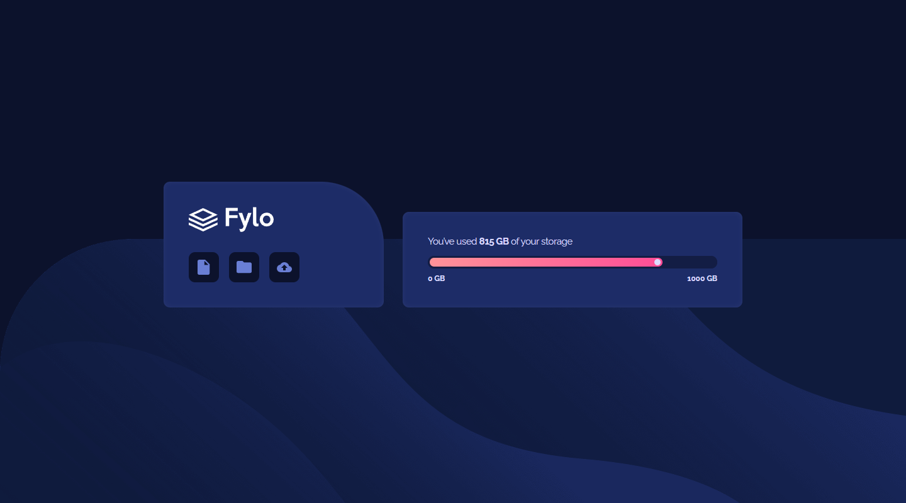
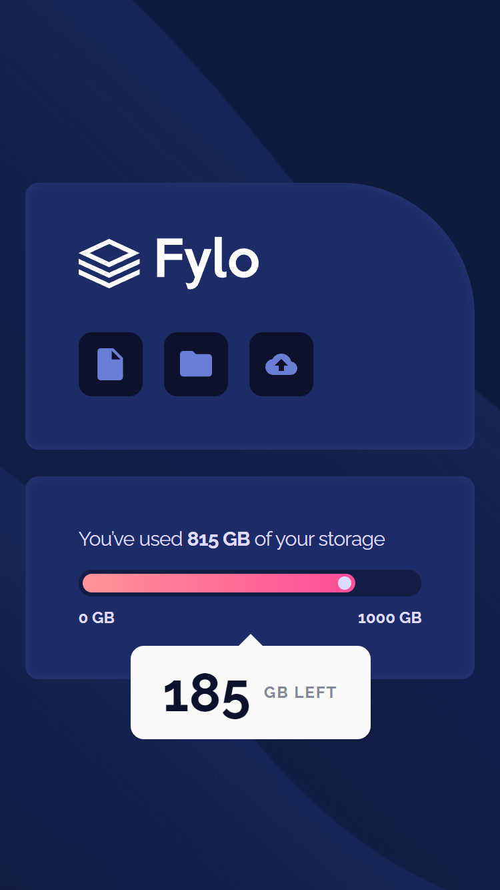

# Frontend Mentor - Fylo data storage component solution

This is a solution to the [Fylo data storage component challenge on Frontend Mentor](https://www.frontendmentor.io/challenges/fylo-data-storage-component-1dZPRbV5n). Frontend Mentor challenges help you improve your coding skills by building realistic projects. 

## Table of contents

- [Overview](#overview)
  - [The challenge](#the-challenge)
  - [Screenshot](#screenshot)
  - [Links](#links)
- [My process](#my-process)
  - [Built with](#built-with)
  - [What I learned](#what-i-learned)
  - [Continued development](#continued-development)
  - [Useful resources](#useful-resources)
- [Author](#author)
- [Acknowledgments](#acknowledgments)

## Overview

### The challenge

Users should be able to:

- View the optimal layout for the section depending on their device's screen size

### Screenshot

### Links

- Solution URL: [https://github.com/virgile-lab/virgile-lab.github.io/tree/main/fylo-data-storage-component-master](https://github.com/virgile-lab/virgile-lab.github.io/tree/main/fylo-data-storage-component-master)
- Live Site URL: [https://virgile-lab.github.io/fylo-data-storage-component-master/](https://virgile-lab.github.io/fylo-data-storage-component-master/)

### Built with

- Semantic HTML5 markup
- CSS custom properties
- CSS Flexbox

## Author

- Frontend Mentor - [@virgile-lab](https://www.frontendmentor.io/profile/virgile-lab)

## Acknowledgments

